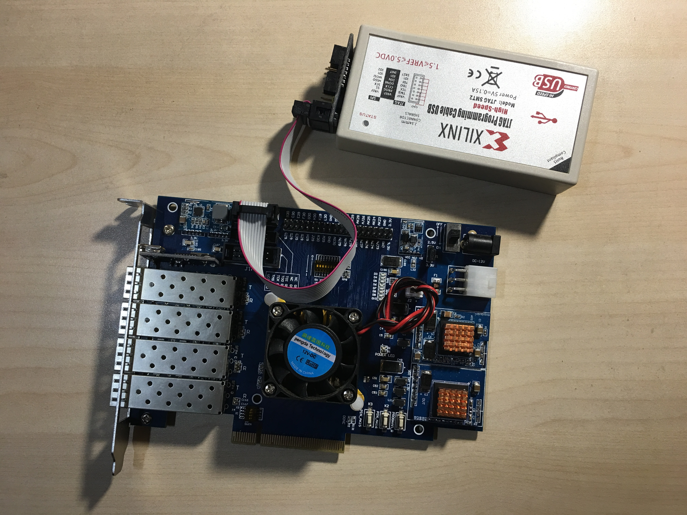
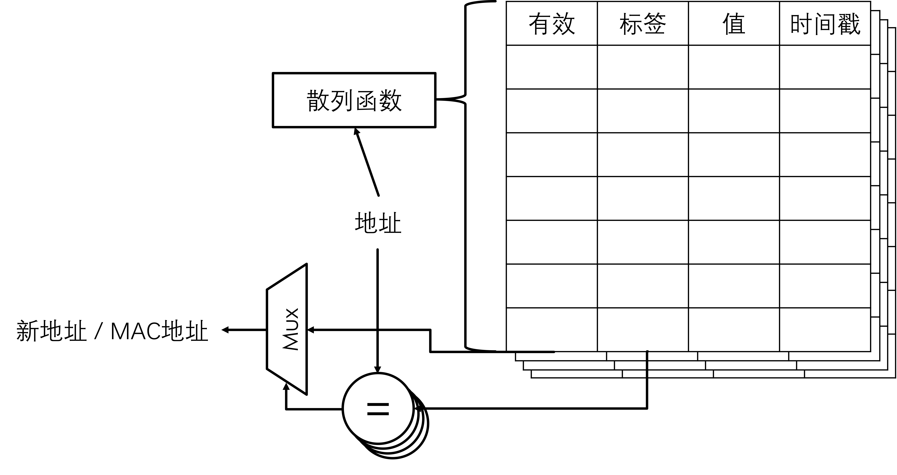

# 基于FPGA的IPv4—IPv6协议翻译器（FPGA-NAT64）设计与实现

## 项目背景与目标

中共中央办公厅、国务院办公厅印发的《推进互联网协议第六版（IPv6）规模部署行动计划》标志着我国正在大力推进IPv6网络的部署建设。然而，现存的大量IPv4网络难以与新建IPv6网络互联互通的问题正成为推进我国互联网络升级建设的显著障碍。

为此，本项目希望基于FPGA设计实现一个IPv4—IPv6协议翻译器（NAT64），实现IPv4网络与IPv6网络的高效互联互通。

具体而言，本项目希望在FPGA上实现：

* IPv4分组至IPv6分组的转换（翻译）；
* IPv6分组至IPv4分组的转换。

同时，本项目希望翻译速率尽可能高。

## 设计与实现

本项目分为硬件部分和软件部分。对于每个到达的分组，硬件部分采用一条流水线对大部分IP分组（包括类型不为ICMP，且 $\texttt{TTL}>1$，且转换后帧长不超过MTU的分组）进行高效处理与转发。软件部分对情况较为复杂的分组进行处理。

### 硬件设计概要

硬件方面，本项目在一个市面上可购买得到的FPGA开发板上完成，该开发板如下图所示：

该开发板售价1198元，配有如下组件：

* 一块Xilinx FPGA，型号为XC7K420T；
* 四个SFP+接口；
* 一个PCIe 2.0 x8接口；
* 一个USB转UART模块。

可以满足项目需要。

FPGA中的逻辑如附件`pipeline.svg`图所示，分为如下模块：

* 上文提到的流水线，该流水线为42级；
* 一个64位的RISC-V软核；
* 可以容纳4096个条目的地址映射表；
* 可以容纳4096个条目的MAC地址表；
* 可以容纳至少1024个条目的IPv4 / IPv6混合路由表；
* Xilinx FPGA的IP核。

后文将对这些模块逐一进行说明。

### 流水线设计

上文已经提到，本项目42级的流水线能够对大部分IP分组进行高效处理与转发，这些分组需要同时满足如下条件：

* 不为ARP分组，
* 目的地址不为该路由器，
* 不为组播IP分组，
* 无需翻译或类型不为ICMP，
* $\texttt{TTL}>1$，
* 无需翻译或地址映射表中存在有效映射，
* 路由转发表中存在有效路由条目，
* 对于下一跳IP地址，MAC地址表中存在有效条目，
* 转换后帧长不超过MTU的分组。

对于流水线可以处理的分组，大致处理流程为：

1. 分组解析：解析IPv4分组或IPv6分组，生成内部中间表示。
2. 确定动作：分析分组解析结果，确定“转发”、“翻译”或“丢弃”动作。
3. 地址转换：若需要进行协议翻译，本阶段查询地址映射表获得转换后的地址。
4. 路由选择：根据目的IP地址查询路由转发表，获得出接口以及下一跳IP地址。
5. 下一跳MAC地址查找：根据下一跳IP地址查询MAC地址表，获得其MAC地址。
6. 重新组包：对内部中间表示重新组包，生成并发送分组。

流水线详细流程图如附件`pipeline.svg`图所示。

值得指出，为了完成协议翻译的功能，本项目对IPv4与IPv6使用同一流水线和统一的内部中间表示，这样，在“IP分组解析”与“重新组包”时即可完成翻译动作。在“确定动作”时，对于一个IP分组，是否需要翻译由如下规则确定：

* IPv4分组的目标地址表示一个IPv6主机时进行翻译；
* IPv6分组的目标地址表示一个IPv4主机时进行翻译；
* 其他分组不进行翻译。

此外，对于需要翻译的分组，流水线还会对已知的四层协议（TCP以及UDP）中的校验和进行增量更新。

本节提到的地址映射表、路由转发表以及MAC地址表将在后几节进行介绍。

### 地址映射表以及MAC地址表设计

地址映射表以及MAC地址表，在后文统称为缓存表，均采用多路组相连的设计：IP地址经过散列函数后作为索引在多个路中并行查询，查询结果的标签与IP地址比较后，选择器选择标签与待查询IP地址相同的路的结果。其结构如下图所示：

此外，该缓存表支持记录时间戳，并提供更新接口，以此支持流水线在查询转换后地址的同时更新对应地址转换条目的超时时间。同时，该缓存表也对软核提供操作接口，并与更新接口共同底层BRAM的端口。更新接口的优先级低于软核，其请求由一个FIFO进行缓冲，在软核不访问该缓存表时，更新模块的有限状态机（FSM）开始处理这些请求。

### 路由转发表设计

本项目的路由转发表采用32级流水Trie树IPv4 / IPv6混合路由转发表的设计，每一级Trie树节点为一级流水线。该Trie树中，每级消耗地址的4位，每个节点有16个子节点。

本项目还考虑了路由转发表的另一种方案，为FPGA实现的T-CAM，但目前暂未实现。

### 软件设计

软件的主要任务是处理流水线不便处理的复杂分组，根据分组的特征可以分为如下几类处理情况：

* 对于ARP分组、目的地址为该路由器的分组或组播IP分组，软件部分接收这些分组，并运行相应的协议。

* 对于需要翻译且类型为ICMP的IP分组，软核对这些分组进行软件翻译。
* 对于$\texttt{TTL}\le1$或分组长度超过MTU的分组，软件发送相应ICMP错误消息并丢弃该分组。
* 对于需要翻译但地址映射表中不存在有效映射的分组，软件创建并下发IPv4—IPv6地址转换规则，然后进行剩余翻译流程。
* 对于路由转发表中不存在有效路由条目的分组，软件发送相应ICMP错误消息并丢弃该分组。
* 对于需要翻译或转发但MAC地址表中不存在有效MAC条目的分组，软件发送一个ARP或NDP请求。在该请求对应的响应到达时，软件会填充MAC地址表的相应条目，以便此后的分组通过流水线处理与转发。

为了实现上述功能，软件分为如下模块：

* （实时）操作系统内核：负责进行多个线程的调度、上下文切换，以及对硬件进行轮询，在定时器超时或某个接口收到以太网帧时切换到相应处理线程。
* 指令集架构抽象层：对指令集架构进行抽象，并向其他模块提供与具体指令集架构无关的接口。这些接口主要包括线程的上下文切换等。
* 硬件抽象层、硬件驱动程序：配置硬件寄存器、控制硬件操作，收发以太网帧，并向其他模块提供与硬件实现细节无关的接口。
* IP协议栈：实现了IP（协议）及其相关协议，包括ARP、IPv4、IPv6、ICMP、ICMPv6、MLD以及NDP等协议。
* 协议翻译逻辑：在IP协议栈的基础上实现了IPv4—IPv6协议的翻译。

### Rust语言版软件设计

还未开发完成的Rust语言版软件有如下特点：
* 使用完全安全的Rust代码进行编写
* 编译为RISC-V静态库，与C版本框架链接
* 构造pcap数据包进行单元测试和仿真测试
* 测试实现了90%的代码覆盖率
* 真机测试正在进行中……
* https://github.com/wangrunji0408/NAT464-rs

## 性能评估

本节尝试了各种连接组合对本项目进行了性能评估，评估结果请参见幻灯片相关页面。

## 结束语

总而言之，本项目设计、实现并评估了一个四万兆光口支持IPv4—IPv6协议翻译的双栈路由器。希望本项目对现存IPv4网络与新建IPv6网络的互联互通有所帮助。

本项目在[GitHub](https://github.com/twd2/fpga-nat64)开源。

## 团队分工

本项目团队分工如下表所示：

| **成员**       | **分工**                                  |
| -------------- | ----------------------------------------- |
| twd2           | 硬件逻辑设计与实现、C语言版软件设计与实现 |
| wangrunji0408  | ARP实现、Rust版软件设计与实现             |
| wangyisong1996 | 进行性能评估                              |

根据IETF精神，本项目团队没有国王。